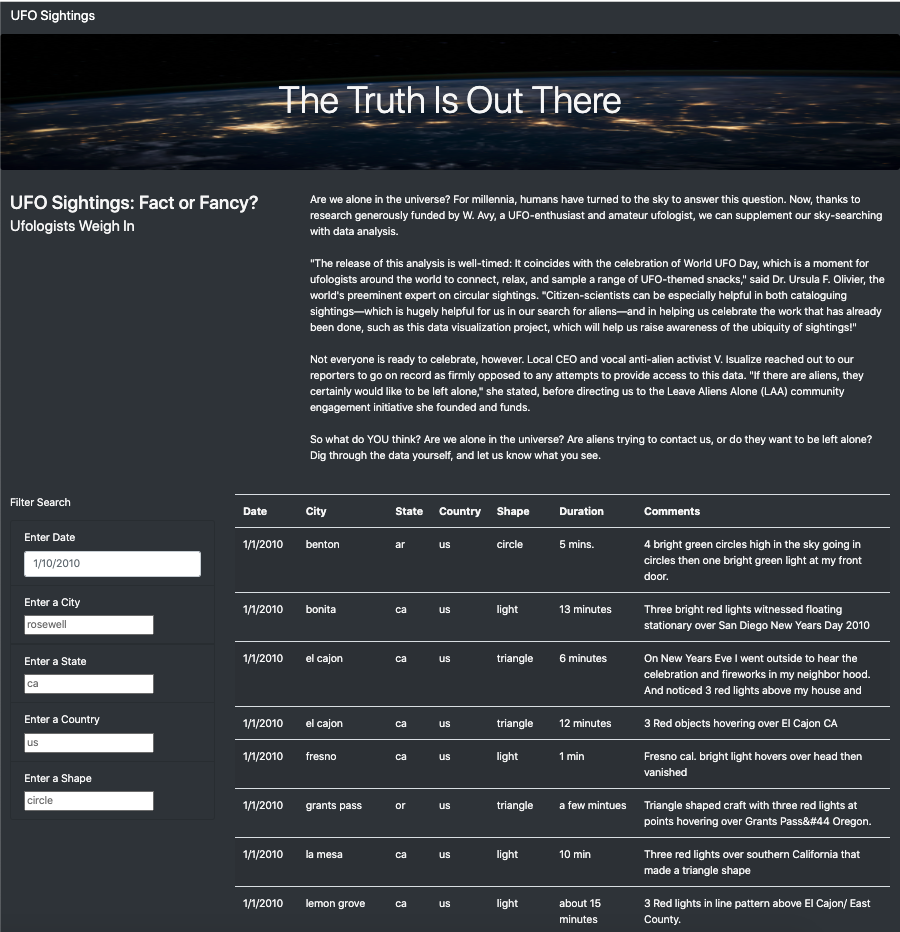
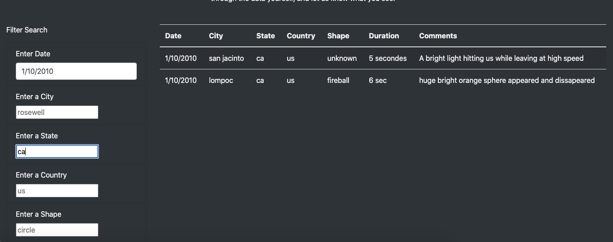

# UFOs

## Overview of Project: Explain the purpose of this analysis.
- In this project, we are using javascript, HTML, and other skills to create a  dynamic webpage for UFO lovers to find and filter the information they want. The users have access to the whole database of all the UFO encounters and can filter the data by inputting five displayed choices: event date, city, State, Country, and shape.

## Results:
- The webpage is pretty easy to use and self-explaining. The page consists of three parts. The top image and title, the input form on the bottom left, and the data display on the bottom right. If the user fresh the page, it will go back to the default page where all the information is listed. 

- Once the users enter the filter values in the input form on the left of the page, the information will be shown on the right of the page. The user can enter from one to five filters based on their needs for the information search. We recommend our users start from one filter and add up so they won't miss the information they want.

## Summary:
#### Drawbacks:
- the webpage is usable for a small amount of dataset. But it would be tough use when the data amount becomes immense. The default set of showing the whole dataset when launching the page could be messy once we have thousands or millions of lists. And any error types in the filter form can lead to a blank page without any data.
#### Two Recommendations:
- For further development to improve the webpage, I recommend changing the input form to a drop-down form with all filter values listed. The users do not have to manually type the date, city, or other information they want. They can just choose from it to ensure the correctness of the input format.
- Give the users two buttons, one to refresh the page and the other one to choose the default setting. For UFOs, it's OK to show everything as the default page, but if we have a lot more data in the future, we can set the most recent 20 lists as the default page, and the users can click the button to check the complete list.

